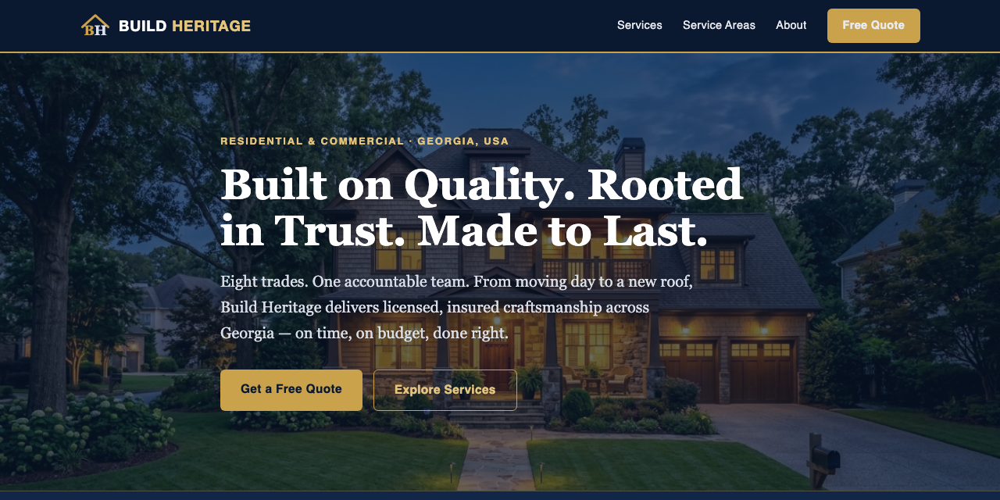

# Build Heritage

Source for **buildheritage.org**, a static lead-generation site for a Georgia home-services company covering eight trades.

 

**Try it: https://buildheritage.org/**

## What it does

- Pure static HTML/CSS, hosted free on GitHub Pages
- One page per trade plus a contact flow

## Run it

Open `index.html`.

---

**If this is useful to you, a ⭐ on the repo helps other people find it.** Issues and pull requests are welcome.

Built by [Priyankar "Sunny" Chakraborty](https://github.com/suncal) · [everbuiltstudio.com](https://everbuiltstudio.com)
